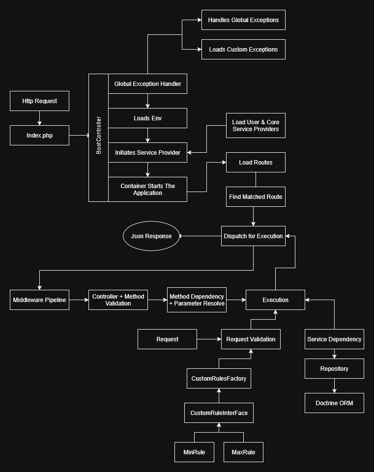

# 🎯 PHP MVC Framework

This is a lightweight, modular MVC framework built entirely from **scratch** using PHP 8.1+, inspired by the design principles of modern frameworks like **Laravel** and **Spring Boot**. It was designed as a **portfolio project** to demonstrate my deep understanding of PHP internals, clean architecture, service container patterns, and advanced concepts such as middleware pipelines, dependency injection, resolving classes using service container, Doctrine ORM (v3.5) integration and unit testing.

As a backend developer with experience in both **PHP** and **Spring Boot**, I built this framework to:

- Showcase transferable architectural knowledge across languages
- Mirror Spring Boot's modular, service-driven structure in PHP
- Explore how core backend principles (IoC, routing, layered design) translate between ecosystems

This framework can serve as a learning tool, a skeleton for future projects, or a demonstration of how to apply enterprise-grade patterns using native PHP and modern libraries like **PHP-DI**, **Doctrine**, and **Respect/Validation**.


## ✨ Features

- ✅ PSR-4 Autoloading via Composer
- ✅ Custom HTTP Routing System (GET, POST)
- ✅ Controller + Dependency Injection (DI Container)
- ✅ Middleware Support (Global & Route-Level)
- ✅ Request Validation
- ✅ Doctrine ORM (v3.5) Integration
- ✅ Service Provider Registration System
- ✅ Environment load support for config file
- ✅ Custom Exception Handler & JSON Response Builder
- ✅ Layered Architecture (Controller → Service → Repository → Entity)
- ✅ PHPUnit-ready Structure


## 🧱 Framework Internals

- **Language:** PHP 8.1+
- **ORM:** Doctrine ORM v3.5
- **Architecture:** MVC + Layered/Clean Code, PHP-DI
- **Package Manager:** Composer
- **Testing:** PHPUnit

## 📖 Internal Design Docs

The core architecture diagram below illustrates the high-level structure of this custom PHP MVC framework. It follows a Layered Architecture approach, emphasizing clean separation of concerns across components.

- Routing Layer handles incoming HTTP requests and delegates to controllers based on route definitions.
- Controller Layer serves as the entry point for business logic and coordinates between services and HTTP responses.
- Service Layer encapsulates application logic and mediates between controllers and repositories.
- Repository Layer abstracts data persistence and interacts with the database through Doctrine ORM.
- Entity Layer defines the data models mapped to database tables.
- Middleware allows pre/post-processing of HTTP requests (e.g., authentication).
- Dependency Injection Container (via PHP-DI) manages class dependencies and configuration.
- Service Providers register and configure framework services (e.g., ORM, validators, exception handler).
- Validation Layer uses Respect/Validation for request input handling.
- Environment Configuration is loaded from .env to allow flexible config per environment (local, staging, production).

This modular design allows developers to build clean, maintainable, and testable backend applications with minimal boilerplate.



### 📘 Notes

This project demonstrates the foundational structure and design of a custom PHP MVC framework, inspired by modern backend architecture principles.

📌 Note:
Detailed documentation for the core components (such as routing engine, middleware execution flow, DI container internals, etc.) will be added in a future update under the /docs directory.

Stay tuned for deeper insights into how each part of the framework is crafted and how you can extend it for your use case.

## 🗂️ Folder Structure

```angular2html
/App -> Application code
    /Controllers -> Handles incoming request
    /Repositories -> Works on accessing model
    /Models -> Doctrine orm managed model
    /Services -> handles logic separated from controller
    /Service Providers -> Provides dependency resolving feature
    /Validation -> Validates incoming request data and parameters
    /Middleware -> Allows to add any logic before hitting controller
/Core → Framework core (Router, DI, etc.)
/public → Front controller (index.php)
/route → Web routes
/config → App configuration
/tests → Unit tests
```

## 🚀 Installation

1. Clone the repository:

```bash
git clone https://github.com/yourusername/php-framework.git
```

2. Install dependencies:
```angular2html
cd php-framework
composer install
```

3. Run project
```angular2html
php -S localhost:8000 -t public
```

## 🧪 Practical Example

### 1. Route

```php
$this->router->get("/users/all", [UserController::class, "getUsers"]);
$this->router->post("/users/add", [UserController::class, "addUser"]);
```

### 2. Route with param and query

```php
$this->router->get("/users/{id}", [UserController::class, "getUser"]);
$this->router->get("/users/all?sort=asc", [UserController::class, "getUser"]);
```

### 3. Middleware

#### I. Create a middleware

```php
<?php
namespace App\Middlewares;

use Core\Middleware\IMiddleware;
use Core\Request\Request;

class ExampleMiddleware implements IMiddleware
{
    public function next(Request $request): bool
    {
        // add logic
        return true;
    }
}
```

#### II. Group Middleware

```php
$this->router->group([ExampleMiddleware::class], function (){
    $this->router->post("/", [HomeController::class, "home"]);
});
```

III. Route middleware

```php
$this->router->get("/users/{id}", [UserController::class, "getUser"])->middleware(RouteMiddleware::class);
```

### 4. Controller
```php
<?php

namespace App\Controllers;

use App\Services\UserService;
use Core\Request\Request;

class UserController
{
    public function __construct(private UserService $userService){}

    /**
     * @param Request $request
     * @return \App\Models\User
     */
    public function getUser(Request $request)
    {
        return $this->userService->getUser($request->input("id"));
    }
}
```

### 5. Request Validation

Respect/Validation is a powerful standalone PHP validation library that provides a fluent, expressive interface for validating user input. It supports complex validation rules, nested validation, and custom rules, making it ideal for clean and readable request validation.

This framework uses [Respect/Validation](https://github.com/Respect/Validation) to validate incoming request data before reaching the controller layer, helping enforce data integrity early in the request lifecycle.

#### 5.1 Additional Validation Rules Support (TBC)

```php
1. min:10
2. max:15
```

#### 5.2 Application of validation class

I. Create a validation class
```php
<?php

namespace App\Validations;

use Core\Request\Request;
use Core\Validation\RequestValidation;

class UserValidation extends RequestValidation
{
    public function __construct(private Request $request){
        parent::__construct($this->request);
    }

    protected function rules(): array
    {
        return [
            "name" => "alpha",
            "email" => "email",
            "phone" => "number|min:11"
        ];
    }

    public function validated(): array
    {
        return $this->validatedData;
    }
}
```


II. Inject in controllers to validate the incoming data within a request 
```php
<?php

namespace App\Controllers;

use App\Services\UserService;
use App\Validations\UserValidation;
use Core\Request\Request;

class UserController
{
    public function __construct(private UserService $userService){}

    /**
     * @param Request $request
     * @param UserValidation $userValidation
     * @return \App\Models\User
     */
    public function addUser(Request $request, UserValidation $userValidation)
    {
        $data = $userValidation->validated();
        return $this->userService->adduser($data);
    }
}
```

### 6. Model (Doctrine ORM)

[Doctrine ORM](https://www.doctrine-project.org/) is a powerful, flexible Object-Relational Mapper for PHP. It allows you to map PHP classes to database tables using annotations, XML, or YAML, and interact with the database using high-level object-oriented code instead of raw SQL. This framework integrates Doctrine ORM v3.5, offering full support for Entities, Repositories, and custom DQL queries.

#### Creating a model

```php 
<?php

namespace App\Models;

use Doctrine\ORM\Mapping as ORM;
use App\Repositories\UserRepository;

#[ORM\Entity(repositoryClass: UserRepository::class)]
#[ORM\Table(name: "users")]
class User
{
    #[ORM\Id, ORM\GeneratedValue, ORM\Column]
    private int $id;

    #[ORM\Column]
    private string $name;

    #[ORM\Column]
    private string $email;

    public function getId(): int
    {
        return $this->id;
    }

    public function getName(): string
    {
        return $this->name;
    }

    //setters
    public function setName($name): void
    {
        $this->name = $name;
    }
}
```

Make sure to use ```#[ORM\Entity(repositoryClass: UserRepository::class)]``` in model to use repository. Replace ```UserRepository::class``` with the desired repository class.

### 7. Repository


```php 
<?php

namespace App\Repositories;

use App\Models\User;
use Doctrine\ORM\EntityManagerInterface;
use Doctrine\ORM\EntityRepository;

class UserRepository extends EntityRepository
{
    /**
     * UserRepository constructor.
     * @param EntityManagerInterface $em
     */
    public function __construct(private EntityManagerInterface $em){
        parent::__construct($em, $em->getClassMetadata(User::class));
    }

    /**
     * @param array $data
     * @return User
     */
    public function createUser(array $data): User
    {
        $user = new User();
        $user->setName($data["name"]);
        $user->setEmail($data["email"]);
        $this->em->persist($user);
        $this->em->flush();
        return $user;
    }
}
```

### 8. Service Container & Provider

#### Service Container (Dependency Injection Container)
This framework uses [PHP-DI](https://php-di.org/), a modern and powerful dependency injection container for PHP. It provides autowiring, configuration-based bindings, and constructor injection, allowing services and dependencies to be resolved automatically with minimal boilerplate.

PHP-DI powers the framework’s service container, enabling clean and maintainable architecture through centralized service registration and automatic dependency resolution.

#### Service registration using service provider

A Service Provider is a class responsible for binding dependencies (services) into the framework's service container. It defines how core components like the router, request, response, entity manager, or custom services should be instantiated and made available throughout the application.

#### 8.1 Creating a simple service
```php
<?php

namespace App\Services;

class TestService
{
    private $name;

    public function __construct(string $name){
        $this->name = $name;
    }
}
```

#### 8.2 Registering service class in a service provider
```php
<?php

namespace App\ServiceProviders;

use App\Services\TestService;
use Core\ServiceProvider\ContainerBuilderDefinition;
use Core\ServiceProvider\IServiceProviderRegister;

class TestServiceProvider implements IServiceProviderRegister
{
    public function register(): ContainerBuilderDefinition
    {
        return new ContainerBuilderDefinition(TestService::class, new TestService("test_name"));
    }
}
```

#### 8.3 Binding Service provider to the container in ```/ServiceProviders/register.php```
```php
<?php

return [
    \App\ServiceProviders\TestServiceProvider::class,
];
```

### 9. Config 

#### 9.1 Database config
Set proper driver name and config to use your desired database in ```/config/database.php```. Project connect with driver used in ```use``` key.

```php
<?php

return [
    "use"     => "pdo_mysql",
    "drivers" => [
        "pdo_mysql" => [
            'driver'   => 'pdo_mysql',
            'dbname'   => $_ENV["DB_DATABASE"],
            'user'     => $_ENV["DB_USERNAME"],
            'password' => $_ENV["DB_PASSWORD"],
            'host'     => $_ENV["DB_HOST"]    ?? "127.0.0.1",
            'port'     => $_ENV["DB_PORT"]    ?? 3306,
            'charset'  => $_ENV["DB_CHARSET"] ?? 'utf8mb4'
        ],
        "pdo_pgsql" => [
            'driver'   => 'pdo_pgsql',
            'dbname'   => $_ENV["DB_DATABASE"],
            'user'     => $_ENV["DB_USERNAME"],
            'password' => $_ENV["DB_PASSWORD"],
            'host'     => $_ENV["DB_HOST"]    ?? "127.0.0.1",
            'port'     => $_ENV["DB_PORT"]    ?? 5432,
            'charset'  => $_ENV["DB_CHARSET"] ?? 'utf8mb4'
        ]
    ]
];
```

### 10. Unit test support

This framework comes with PHPUnit and Mockery integration out of the box, enabling you to write clean, isolated, and fast unit tests.

#### 10.1 Setup

Make sure dependencies are installed

```
composer instal
```

To enable test coverage make sure Xdebug is installed and enabled.

#### 10.2 Running Tests

To run all tests
```angular2html
composer test
```

To run specific test class check the given example

```angular2html
vendor/bin/phpunit tests/Unit/UserControllerTest.php
```

To run single test method
```angular2html
vendor/bin/phpunit --filter testMethodName tests/Unit/YourTestClassName.php
```

To generate html test coverage

```angular2html
composer test:coverage
```

#### 10.3 Features

- Unit tests live under the /tests directory.
- Supports Mockery for mocking services, repositories, or requests.
- PHPUnit config in phpunit.xml.
- Follows Laravel-style service testing: mock dependencies, test controllers, services, and middleware.

### 11. Code Style – PHP CS Fixer

This project uses PHP CS Fixer to maintain a consistent code style across the codebase. The config remain in the .php-cs-fixer.dist.php in root directory.

````php
<?php

$finder = PhpCsFixer\Finder::create()
    ->in(__DIR__)
    ->exclude('vendor');

return (new PhpCsFixer\Config())
    ->setRules([
        '@PSR12' => true,
        'array_syntax' => ['syntax' => 'short'],
        'binary_operator_spaces' => ['default' => 'align_single_space_minimal'],
        'blank_line_after_opening_tag' => true,
        'no_unused_imports' => true,
        'single_blank_line_at_eof' => true
    ])
    ->setFinder($finder)
    ->setRiskyAllowed(true)
    ->setUsingCache(true);
````

To fix cs-fixer related issue run the following command

```angular2html
composer cs-fix
```

### 12. 🔄 What’s Next

- CLI Support (Artisan-style)
- Caching (Redis)
- Queue Worker (RabbitMQ)
- Stream data handling using Kafka
- Modular Services (Mailer, FileUploader, Storage support etc.)


## 📄 License

This project is open-sourced under the [MIT License](LICENSE).
